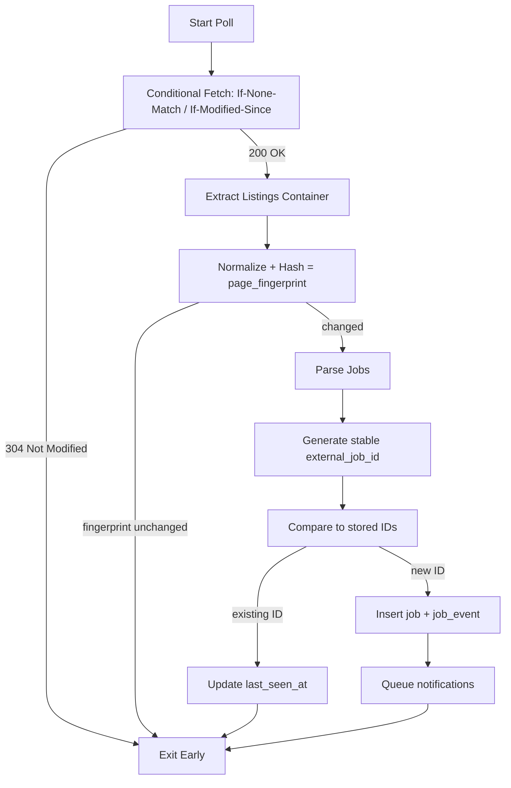

# Scraping MVP Plan

## Scope
This document turns the MVP idea into:
- A concrete **database schema** (minimal required fields).
- A **job/state flow diagram** (single-source loop).
- A **repo mapping** (where code should live in this repo).
- A **polling + scaling strategy** (cadence, backoff, and capacity notes).

---

## 1) Database Schema (Minimal, Single-Source Ready)

### Tables

#### `sources`
Defines each job board or feed to poll.

| column | type | notes |
| --- | --- | --- |
| id | uuid | primary key |
| name | text | human-friendly source name |
| base_url | text | canonical base URL |
| listings_url | text | URL for the listings page or feed |
| enabled | boolean | source on/off switch |
| poll_interval_seconds | integer | overrides global cadence |
| created_at | timestamptz | |
| updated_at | timestamptz | |

#### `source_pages`
Tracks page-level state for each monitored listings URL.

| column | type | notes |
| --- | --- | --- |
| id | uuid | primary key |
| source_id | uuid | FK → sources.id |
| url | text | same as listings_url (or multiple if needed) |
| etag | text | for `If-None-Match` |
| last_modified | text | for `If-Modified-Since` |
| page_fingerprint | text | hash of normalized listings container |
| last_checked_at | timestamptz | last poll attempt |
| last_success_at | timestamptz | last successful poll |
| consecutive_failures | integer | resets on success |
| created_at | timestamptz | |
| updated_at | timestamptz | |

#### `jobs`
Core job record (normalized, not user-specific).

| column | type | notes |
| --- | --- | --- |
| id | uuid | primary key |
| source_id | uuid | FK → sources.id |
| external_job_id | text | stable ID from source (or derived hash) |
| title | text | job title |
| company | text | company name |
| location | text | location string |
| source_url | text | deep link |
| job_fingerprint | text | hash of job content |
| first_seen_at | timestamptz | first discovery |
| last_seen_at | timestamptz | last time observed |
| created_at | timestamptz | |
| updated_at | timestamptz | |

**Indexing guidance**
- `jobs (source_id, external_job_id)` unique index for dedupe.
- `source_pages (source_id, url)` unique index.
- `jobs (source_id, first_seen_at)` for fast alerting queries.

#### `job_events` (optional but useful MVP)
Append-only log of discovered jobs for notifications.

| column | type | notes |
| --- | --- | --- |
| id | uuid | primary key |
| job_id | uuid | FK → jobs.id |
| source_id | uuid | FK → sources.id |
| event_type | text | e.g., `new_job`, `repost`, `edited` |
| created_at | timestamptz | |

---

## 2) Job/State Flow Diagram (Single Source)

**Exit-early logic is the speed multiplier.** Most polls stop at steps B or E.

---

## 3) Repo Mapping (Where This Lives)

**Current repo structure**
- `backend/src/core` → config + shared app utilities
- `backend/src/database` → DB connections and shared DB utilities
- `backend/src/main.py` → app entrypoint

**Proposed MVP placement**
- `backend/src/scraper/` *(new module)*
  - `interfaces.py` → `fetch()`, `fingerprint()`, `extract_jobs()`
  - `engines.py` → core loop (shared) + delta detection
  - `sources/` → per-site implementations (e.g., `greenhouse.py`, `lever.py`)
- `backend/src/database/models.py` *(new or expanded)*
  - SQLAlchemy models for `sources`, `source_pages`, `jobs`, `job_events`
- `backend/src/tasks/` *(new module or reuse celery in core)*
  - polling tasks scheduled per source

**Why this mapping works**
- Keeps source-specific logic isolated in `scraper/sources`.
- Shared change-detection logic lives in `scraper/engines`.
- DB schema is in `database/models` with migrations via Alembic.

---

## 4) Polling Schedule + Scaling Strategy

### Default Polling Cadence
- **Base cadence**: every **2 minutes** per source (adjust per site)
- **Burst mode**: 30–60 seconds for ultra-competitive sources
- **Low-priority sources**: 5–10 minutes

### Backoff / Retry
- `429` rate-limited → exponential backoff (e.g., 1m → 2m → 4m → 8m)
- `5xx` errors → short retry window (30s–2m), then normal
- `consecutive_failures >= 5` → flag source for manual review

### Parallelism Model
- **Horizontal**: one worker process can handle N sources; scale by adding workers
- **Isolation**: each source is idempotent and stateless except DB records

### Capacity Planning (MVP)
- With early exits, most runs are cheap (304 or fingerprint unchanged)
- **Bottleneck is the number of sources × polling cadence**

### Metrics to Track
- `time_to_detect` (posting → detection time)
- `poll_success_rate`
- `duplicate_alert_rate`
- `average_poll_duration`

---

## 5) MVP Success Criteria (Engineering)

1. Stop the system for 6 hours → only jobs posted during downtime are detected.
2. No duplicate alerts across restarts.
3. 90%+ of polls exit at 304 or fingerprint-check.
4. End-to-end alert latency under 2 minutes for key sources.

---

## 6) Implementation Checklist (Non-Code)

- [ ] Define Alembic migrations for the schema above.
- [ ] Add a single source adapter (one job site) to validate engine loop.
- [ ] Wire “new job” events to a minimal notification sink (log or email).
- [ ] Add monitoring fields and alert on repeated failures.
